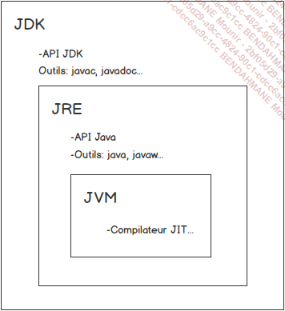
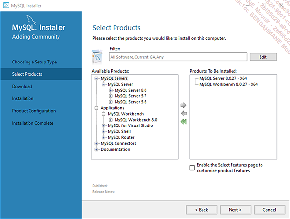
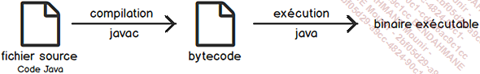
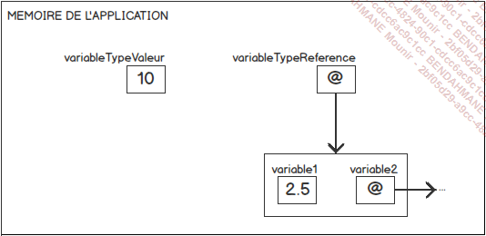
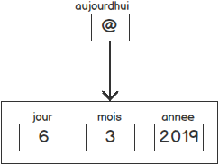
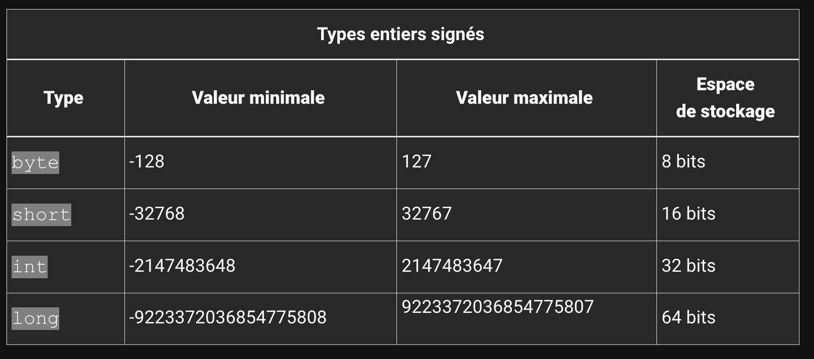
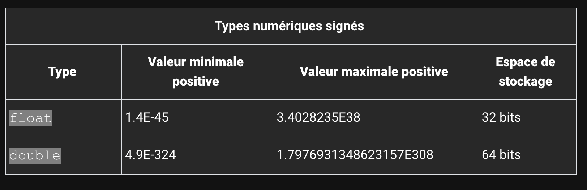
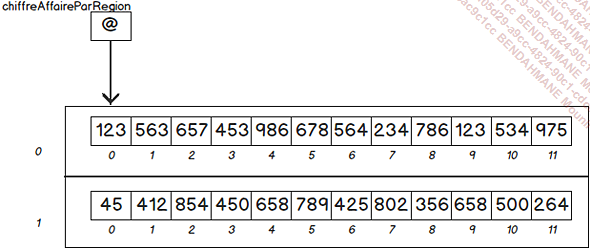
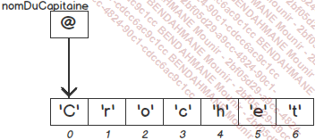

# JAVA

JAVA :

- Langage systeme simple, orienté objet et interprété,
- otpimisation du temps des cycles de dev. (compilation et execution)
- Les applications produites sont portables : cross platform.
- Par rapport au C++ gestion de la memoire et des erreurs sont simplifiées.
- Il est possible de creer des applications multi threadés
- Les applications sont trés robustes et sécurisées grâce à des verifications du bytecode avant exécution.

## La plateforme JAVA



- JDK : Java Dev Kit
- API
- javac : le compilateur java
- JRE (Java runtime env) : l'environnement d'execution installe sur la machine cliente. Il propose notamment l'outil Java qui permet d'executer les programmaes java
- JVM (Java virtual machine): permet l'execution du programme passe en param. de la commande `java`

## La machine virtuelle Java

Elle est mise a disposition pour de multiples OS.

##### Ses roles sont multiples:

- elle charge des classes (et leur bytecode), a l'instanciation d'une classe c'est elle qui charge le bytecode à interpréter
- elle gère la mémoire:
  les pointeurs et les références. Elle gère aussi la libération de la mémoire : `Garbage Collector`
- Elle gere aussi la securité
- interfaçage avec du code natif

## L'API JAVA

Ensemble de logiciels pre conçu pour fournir un grand nombre de fonctionnalités.
L'API Java 17 :

- 21 modules
- 220 packages (l'equivalent des bibliotheques de classes en C# ou des librairies en langage C)
- Plus de 4000 classes et interfaces mises a disposition

### Deux implementations pour une plateforme

- Oracle JDK
- OpenJDK

Il est recommandé d'ajouter `JAVA_HOME` en tant que variable d'environnement:

```
C:\Users\Dev\Desktop\Java\jdk-17.0.2
```

Ensuite vous modifiez la variable d'environnement PATH avec l'entrée:

```
...;%JAVA_HOME%\bin
```

### L'IDE

Eclipse ou IntelliJ

### MySQL

Vous devez installer mySQL :

- `on premise`
- avec wamp (mamp, xamp, ...)
- avec Docker
- dans le cloud
- ...



### Votre premier programmae en JAVA

Un programme java est une collection de fichiers java destinés à fonctionner ensemble.



Il faut plusieurs étapes pour l'exécution d'un programme JAVA :

- compilation: code source (en java) -> bytecode (langage intermédiaire). Le bytecode n'est pas du binaire
- C'est la JVM qui charge le bytecode et le compile à la volée (JIT: just in time) pour exécuter du code qui sera compréhensible par la machine hote

Popur utliser le compilateur:

```sh
javac nom_de_votre_fichier_source
```

Pour executer le bytecode :

```
java nom_de_votre_fichier_bytecode
```

## Structure des programmes JAVA

En java, tout est objet:

```java
public class Nom
{
    // votre super code java
    public static void main(String[] args)
    {
        // votre super code java
    }
    //votre super code java
}
```

### Les variables en java

instance de classe : l'objet créé à partir d'une classe

Les categories de variables:

- **les variables d'instance**: n'existe que si une instance de classe est disponible. Chaque instance possède sa propre version de la variable
- **Les variables de classe**: elles sont aussi declarees a l'interieur d'une classe mais avec le mot clé `static` . La variable de classe est disponible directement depuis la classe et existe en un exemplaire unique. On peut avoir 50 instances d'une meme classe, mais la valeur d'une variable de classe est unique.
- **les variables locales** sont déclarées a l'interieur d'une methode

##### La nomenclature des variables:

- le nom d'une variable commence par une lettre
- lettres, chiffres et underscore
- nombre illimité de caractères
- case Sensitive / sensible a la casse
- keywords
- camel case: le nom commence par une minuscule et chaque nouveau mot commence par une maj.

#####Les types de variables :

On distingue deux types de variables:

- Les types valeurs : celles qui stockent des valeurs
- les types references : celles qui ne stockent pas reelleement de valeur



Les types valeurs designent les types primitifs, on en compte 4 en java : entiers, decimaux, les chars et les bool.

Les types references designent un type plus complexe : un ensemble coherent de variables.
Ils contiennent une reference vers ces variables.



##### La declaration

En java :

```java
[modificateurs] type maVariable;
```

On peut declarer plusieurs variables du meme type sur la meme ligne:

```
type var1, var2, var3, var4;
```

Exemple:

```java
int ageDeTom;
Date armistice, noel;
```

Pour initialiser une variable:

```java
int frenchWorldCupYear = 1998;
```

Les types d'entiers



Les types decimaux



Les constantes

Il arrive que des variables ne doivent pas etre modifiees au cours de l'execution du programme: il convient alors de definir des constantes

Pour definir une constante on utilise le mot cle `final`:

```java
    final double PI = 3,1415926535897932384626433832795028841971693993751058;
```

L'initialisation de la constante est obligatoire lors de sa declaration.
Souvent les constantes sont definies comme membres statiques.
Par convention on les ecrit en majuscules.

Les enumerations :
Elles permettent de definir un ensemble de constantes :

```java
    public enum Month
    {
        JANVIER,
        FEVRIER,
        MARS,
        AVRIL,
        MAI,
        JUIN,
        JUILLET,
        AOUT,
        SEPTEMBRE,
        OCTOBRE,
        NOVEMBRE,
        DECEMBRE
    }
```

L'equivalent avec une classe :

```java
public class Month
{
    public static final int JANVIER = 0;
}
```

La declaration d'ume enum peut etre considere commue l'utilisation d'une "classe cachee". Cette classe herite de `java.lang.Enum`

Pour creer un dalton :

```java
Dalton temel = Dalton.AVERELL;
```

### Les tableaux

```java

int[] unTableau;

// on doit preciser la taille du tableau
// entre crochets
unTableau = new int[122];

// avec cette syntaxe pas besoin de preciser
// la taille, elle est automatiquement determinee
// lorsque
int[] autreSyntaxe = {3, 4, 5, 6, 8};
```

On peut acceder aux elements d'un tableau de cette maniere :

```java
autreSyntaxe[4];
```

Si vous tentez d'acceder a un index inexistant vous allez obtenir une exception de type : `ArrayIndexOutOfBoundException`

Il est possible de travailler avec des tableaux a plusieurs dimensions :


La syntaxe pour recuperer des elements dans un tableau a 2D est la suivante:

```java
int elemTableau2D = tableau2D[0][1];
```

autre methodes de creation :

```java
int[][] matrice;
matrice = new int[2][];
matrice[0] = new int[4];
matrice[1] = new int[4];
```

```java
// permet de definir un tableau 2D avec deux lignes et
// trois colonnes
int [][] encoreUneAutreSyntaxe = {{1, 3, 4}, {23, 21, 22}};
```

Creez un tableaux contenant 10 `String`, et remplir ce tableau avec des adresses mail, exemple

```
"jpp@sfr.fr";
"tom@gmail.com";
"fred@sfr.fr";
"victor@sfr.fr";
"chris@sfr.fr";
"robert@orange.fr";
"paul@sfr.fr";
"lise@gmail.com";
"thierry@isitech.fr";
"marie@isitech.fr";
```

Calculez le pourcentage de fournisseurs de services mail.
(pour une adresse @gmail.com le fournisseur est gmail).

Consultez la javadoc :

- String : https://docs.oracle.com/en/java/javase/17/docs/api/java.base/java/lang/String.html

Pour aller plus loin :

- placer ce code dans une fonction
- elle doit prendre en parametre un tableau de String qui contient des adresses mail
- la fonction de doit pas avoir connaissance du nom des fournisseurs
- elle doit toujours afficher le pourcentage de fournisseurs de services mail, quel que soit le nombre de fournisseurs

### Les chaines de caracteres

Les chaines de caracteres sont des objets en java, elles sont donc soumises aux regles de la programmation orientee objet.

```java
String chaine = "une chaine de caracteres";
```

En memoire voici ce que ca donne :


En general on a tendance a considerer les String comme des types primitifs, mais ce n'est pas le cas.
En realite, lorsqu'on cree une string on cree une instance de la classe `String` qui contient un tableau de char.

```java
String chaine = new String("une chaine de caracteres");
```

Apres sa creation une chaine de caracteres ne peut plus etre modifiee. On dit qu'elle est `immutable`.

```java
\* cette instruction ne compile pas *\
chaine = chaine + " et une autre chaine";
```

La classe String nous met a disposition de nombreux outils pour manupuler les chaines de caracteres.

```java
String chaine = "une chaine de caracteres";
chaine.length(); // retourne la taille de la chaine
chaine.charAt(0); // retourne le caractere a l'index 0
chaine.substring(0, 4); // retourne la sous chaine de caracteres de l'index 0 a 4
chaine.indexOf("chaine"); // retourne l'index de la premiere occurence de "chaine"
chaine.replace("chaine", "string"); // remplace la premiere occurence de "chaine" par "string"
chaine.toUpperCase(); // retourne la chaine en majuscule
chaine.toLowerCase(); // retourne la chaine en minuscule
chaine.trim(); // supprime les espaces en debut et fin de chaine
chaine.split(" "); // retourne un tableau de String en decoupant la chaine a chaque espace
chaine.equals("une chaine de caracteres"); // retourne true si les deux chaines sont identiques
chaine.equalsIgnoreCase("UNE CHAINE DE CARACTERES"); // retourne true si les deux chaines sont identiques en ignorant la casse
chaine.startsWith("une"); // retourne true si la chaine commence par "une"
chaine.endsWith("res"); // retourne true si la chaine se termine par "res"
```

#### Comparer les chaines de caracteres

En java il est impossible de comparer deux chaines de caracteres avec l'operateur `==`

```java
String chaine1 = "une chaine de caracteres";
String chaine2 = "une chaine de caracteres";
chaine1 == chaine2; // retourne false
```

Pour comparer deux chaines de caracteres il faut utiliser la methode `equals`

```java
String chaine1 = "une chaine de caracteres";
String chaine2 = "une chaine de caracteres";
chaine1.equals(chaine2); // retourne true
```

Cette fonction compare les chaines de caracteres caractere par caractere.

La methode format permet de formater une chaine de caracteres en utilisant des marqueurs de position.

```java
boolen estVrai = true;
int entier = 10;
double decimal = 10.5;
String chaine = "une chaine de caracteres";
System.out.println("un booleen : %b, un entier : %d, un decimal : %f, une chaine : %s", estVrai, entier, decimal, chaine);
```

ou encore

```java
boolean b=true;
String s="chaine";
int i=56;
double d=5.5;
System.out.println(String.format("boolean : %b %n" +
                 "chaine de caractères : %s %n" +
                 "entier : %d %n" +
                 "entier en hexadécimal : %x %n" +
                 "entier en octal : %o %n" +
                 "décimal : %f %n" +
                 "décimal précis au dixième : %.1f %n" +
                 "décimal au format scientifique : %e %n",
                 b,s,i,i,i,d,d,d));
```
